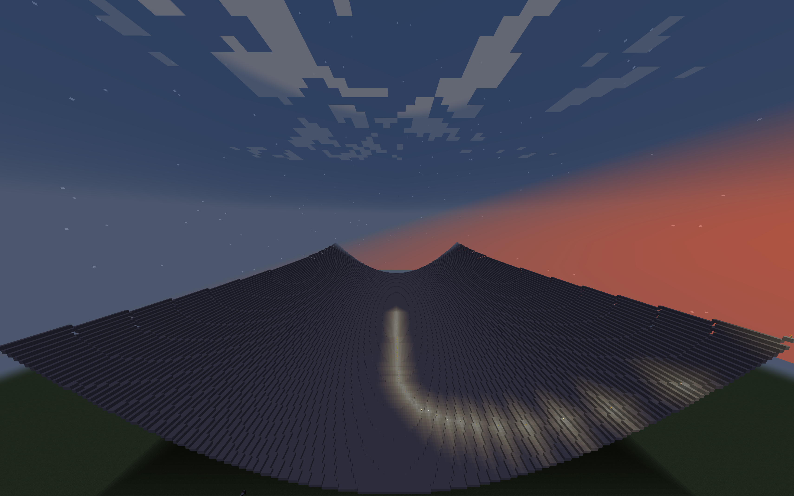
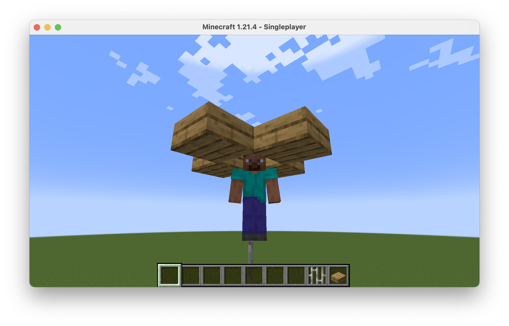

# DoubleVanilla

## Introduction
Visualise vanilla gradient descent in vanilla Minecraft.



## Description
Performs linear regression on one-dimensional data by optimising MSE loss using full-batch, fixed-LR, momentum-less gradient descent, then plot the loss landscape on a square region in a Minecraft world, and watch the path of optimisation.

## Instructions
* Clone this repository:
```sh
git clone https://github.com/ronitkunk/doublevanilla.git
cd doublevanilla
```
* Install the dependencies in `requirements.txt`
```sh
pip install -r requirements.txt
```
* Load training data into `data`/`train.csv`, with each line of the form:
```csv
INPUT, LABEL
```
* Open a Minecraft: Java Edition world and open the console (press 'T'), leaving it empty. Be prepared to switch back to this window shortly.
    * Without modification, the script is designed to work with the standard 4-block-deep "superflat" world type

* To see a list of possible optional arguments and values, use:
```sh
python driver.py --help
```
* Run `driver.py`, specifying suitable optional arguments.
```sh
python driver.py [ARGS]
```

## Extra features

* With the sample train set supplied, an alternate landscape with a saddle point at the location of the usual minimum is obtained with the following modification:
```math
L(w, b; X, Y) = \frac{1}{4n}\sum_{i=1}^{\lfloor n/2 \rfloor}(wX_i+b-Y_i)^2-\frac{1}{4n}\sum_{i=\lfloor n/2 \rfloor +1}^{n}(wX_i+b-Y_i)^2
```
Consequently, the new gradients are
```math
L_w(w, b; X, Y) = \frac{1}{2n}\sum_{i=1}^{\lfloor n/2 \rfloor}X_i(wX_i+b-Y_i)-\frac{1}{2n}\sum_{i=\lfloor n/2 \rfloor +1}^{n}X_i(wX_i+b-Y_i) \\
L_b(w, b; X, Y) = \frac{1}{2n}\sum_{i=1}^{\lfloor n/2 \rfloor}(wX_i+b-Y_i)-\frac{1}{2n}\sum_{i=\lfloor n/2 \rfloor +1}^{n}(wX_i+b-Y_i)
```
* This can be implemented by un-commenting lines in `loss.py` labelled "# Saddle" and commenting out those labelled "# MSE"

## Pointers
* All chunks spanned by the printable region must be loaded.
* Arrange for Minecraft to remain the active window throughout printing, otherwise, commands may be entered into other fields.
    * Entering gibberish into the user password field can lock you out of your system — be sure to prevent sleeping.
* Since the `setblock` command tends to shift the player with each use, it is recommended that you build a stable viewing platform for the player. A sample design is shown in the image below:


## Credits
* Minecraft: Java Edition from [Minecraft](https://www.minecraft.net)
* Python libraries from the [Python Package Index](https://www.pypi.org)
* End signal from [Uppbeat](https://www.uppbeat.io/sfx/category/bell/chime)